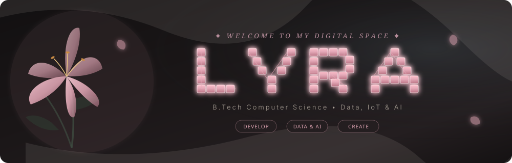
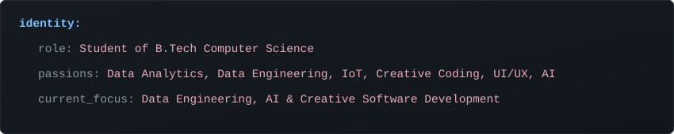

<!-- ==========================================
     DUSTY ROSE & SLATE NOIR GITHUB PROFILE
     Theme: Noir Lily & Glowing Cybertext "LYRA"
     Username: Lyra-4leafclover
     ========================================== -->

  <!-- Header Banner with Integrated Lyra Cybertext -->
  

    

  <!-- Dynamic Typing Header Banner -->
  

   

  <!-- Quote Section -->
  

    <i>"Life meets you at your level of audacity."</i> 
    <b>✦ Crafting functional beauty in code ✦</b>
  

  <!-- Section Divider -->
  

 

## 🥀 About Me

  

 

  

 

## ⚔️ Tech Stack & Tools

  
  
  
  
  
  
  
  
  
  
  

 

  

 

## 📊 Live Real-Time GitHub Analytics

  <!-- REAL-TIME LIVE CONTRIBUTION GRAPH -->
  

    

  <!-- REAL-TIME STREAK STATS -->
  

 

  

 

## 🕯️ Connect with Lyra

  
  
  
  
   
  

  
<i>"Never regret having a good heart. Everything comes back to you, multiplied."</i> 🌸

